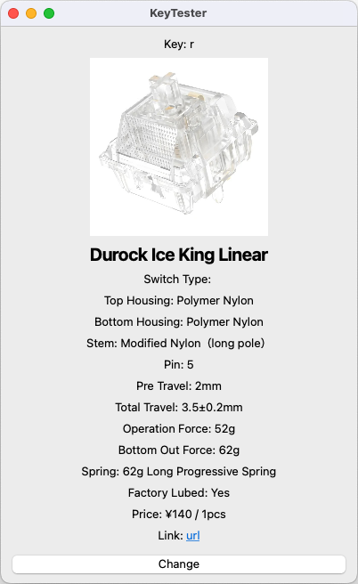

# KeyTester


<details open>
<summary>EN</summary>
KeyTester is a useful application for using mechanical keyboards as key switch testers.
When a key is pressed, pre-registered key switch information is displayed on the screen.<br>



## System Requirements
- macOS (Verified environment: Apple M4, macOS Sequoia)

## How to Use
### Launching the Application

#### Running as a Python script
```shell
python src/main.py
```

#### Running as a Mac application
You can download app for Apple Silicon from [here](https://github.com/tstsukahara/KeyTester/releases), or build it in your platform.
```shell
# Build command
pyinstaller KeyTester.spec
```

### Registering Switch Information
"Switches" menu -> "Edit Switch Info"

### Registering Key Mapping
Press any key -> "Change" button

## Configuration Files
Configuration files are located at "$HOME/Documents/KeyTester" by default.

- Can be changed from "Settings" menu -> "Change Base Directory"
- List of configuration files
    - switch_info.json (Switch information)
    - key_map.json (Key mapping)
    - images/* (Image files)
</details>

<details>
<summary>JP</summary>
KeyTesterは、メカニカルキーボードをキースイッチテスターとして使う場合に便利なアプリケーションです。
キーを押すと、予め登録しておいたキースイッチ情報が画面に表示されます。<br>


## 動作環境
- macOS (検証済み環境: Apple M4, macOS Sequoia)

## 使い方
### アプリケーションの起動

#### Pythonスクリプトとして実行
```shell
python src/main.py
```

#### Macアプリケーションとして実行
ビルドして作成されたdist/KeyTester.appを実行する
```shell
# Build
pyinstaller KeyTester.spec
```
#### Macアプリケーションとして実行
[ここ](https://github.com/tstsukahara/KeyTester/releases)からApple Silicon用Appをダウンロードするか、
利用している環境でビルドする
```shell
# Buildコマンド
pyinstaller KeyTester.spec
```

### スイッチ情報の登録
「Switches」メニュー -> 「Edit Switch Info」

### キーマッピングの登録
任意のキーを押す -> 「Change」ボタン

## 設定ファイルの保存先
$HOME/Documents/KeyTester

- 「Settings」メニュー -> 「Change Base Directory」から変更可能
- 設定ファイルのリスト
    - switch_info.json (スイッチ情報)
    - key_map.json (キーマッピング)
    - images/* (画像ファイル)
</details>